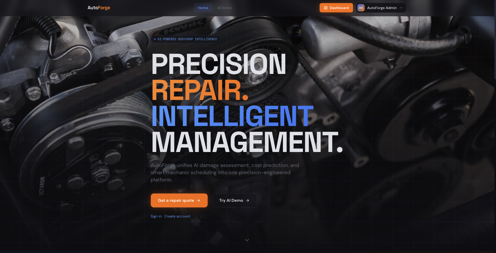
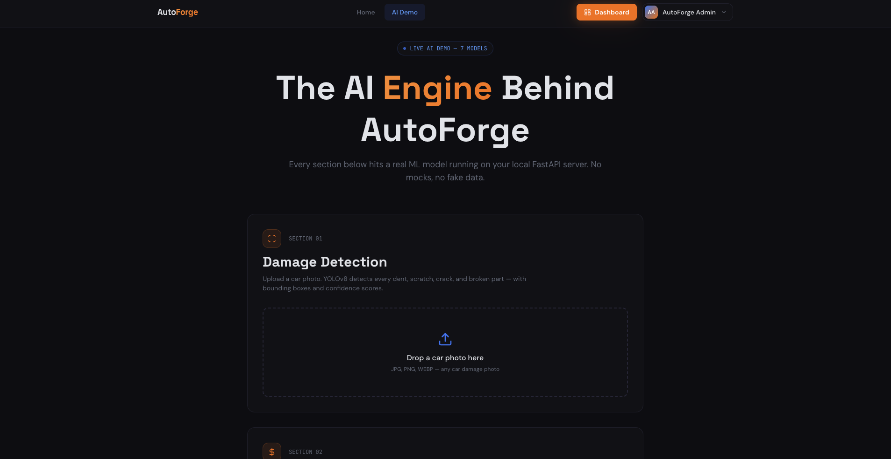
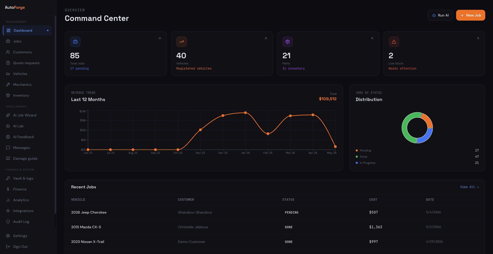

# AutoForge — AI-Powered Car Bodyshop Management Platform

A full-stack management system for car bodyshops that pairs a traditional admin
console with seven production-grade machine-learning services: damage
detection, repair-time and repair-cost estimation, mechanic ranking, parts
inventory forecasting, AI-generated customer messages, and customer-review
sentiment analysis. Built as an internship project.

---

## Screenshots

### Landing page



### Live AI demo (7 models)



### Admin dashboard



---

## Table of contents

- [Screenshots](#screenshots)
- [Architecture](#architecture)
- [Features](#features)
- [Tech stack](#tech-stack)
- [Prerequisites](#prerequisites)
- [Quick start (macOS / Linux)](#quick-start-macos--linux)
- [Quick start (Windows)](#quick-start-windows)
- [Demo accounts](#demo-accounts)
- [Environment variables](#environment-variables)
- [Database setup](#database-setup)
- [Seeding demo data](#seeding-demo-data)
- [Docker](#docker)
- [Project structure](#project-structure)
- [Security](#security)
- [API contract](#api-contract)
- [Troubleshooting](#troubleshooting)

---

## Architecture

```
┌──────────────────────┐    proxy /backend/*    ┌─────────────────────────┐
│  React + Vite UI     │ ─────────────────────▶ │  Next.js API + Prisma   │
│  autoforge-frontend  │                        │  intern-db  (port 3000) │
│  (port 5173)         │                        └────────────┬────────────┘
│                      │                                     │ Prisma
│                      │      X-API-Key + JSON               ▼
│                      │ ──────────────────────▶ ┌─────────────────────────┐
└──────────────────────┘                         │  Neon PostgreSQL        │
            │                                    └────────────┬────────────┘
            │  X-API-Key + multipart/JSON                     │ psycopg2
            ▼                                                 ▼
┌──────────────────────────────────────────────────────────────────────────┐
│                FastAPI AI Microservice  ·  main.py  (port 8000)          │
│                                                                          │
│  YOLOv8 · XGBoost ×3 · Prophet ×5 · DistilBERT · Groq LLaMA-3.1          │
└──────────────────────────────────────────────────────────────────────────┘
```

The Vite dev server proxies `/backend/*` to Next.js on port 3000 to avoid
browser CORS preflights, and calls FastAPI directly at `http://localhost:8000`.

---

## Features

### Admin console (`/admin/*`)

| Page | What it does |
| --- | --- |
| Dashboard | Live KPIs, revenue chart, recent jobs, quick actions |
| Jobs | Job table, filters, Excel export, drill-down detail page |
| AI Job Wizard | Upload a damage photo, get YOLO detections, time + cost prediction, ranked mechanics, then save the job in one flow |
| Customers | Customer table; create new customer with auto-generated temp password |
| Quote requests | Inbound booking inquiries from the public portal |
| Vehicles | Vehicle registry tied to customers and jobs |
| Mechanics | Mechanic roster with skill level, workload, specialty |
| Inventory | Parts stock + Prophet 30/60/90-day forecast charts |
| AI Lab | One-shot playground for every FastAPI endpoint |
| AI Feedback | Compare predictions vs actuals; basis for retraining decisions |
| Damage guide | Curated reference: damage class → typical repair steps |
| Messages | AI customer message generator (English / Arabic) |
| Finance | Revenue series, invoices, Excel export |
| Analytics | Mechanic performance stats, jobs trend |
| Audit log | All admin / AI actions with filterable categories |
| Integrations | Live health of all third-party services |
| Vault (admin only) | AES-256-GCM encrypted API-credential store + integration logs |
| Backup | DB snapshot trigger + restore notes |
| Settings | Profile, password, TOTP enrollment |

### Customer portal (`/portal/*`)

| Page | What it does |
| --- | --- |
| Get a quote | Public form: damage photo upload → instant AI estimate → submit booking inquiry |
| My requests | Customer dashboard: status of submitted inquiries |
| My jobs | Repair jobs assigned to the signed-in customer |
| Job detail | Status timeline, parts list, mechanic, AI predictions |
| Profile | Name, contact, password change |

### Authentication

- Email + password (bcrypt, cost 12)
- Optional **TOTP 2FA** (RFC 6238) with QR-code enrollment
- Password reset by email (SMTP) — falls back to console log in dev
- Role-based access: `admin`, `mechanic`, `customer`
- Route guards in React (`PrivateRoute`, `AdminOnly`, `StaffOnly`,
  `CustomerOnly`) and middleware in Next.js (`requireRole`)

### AI services (FastAPI)

| # | Endpoint | Model | Notes |
| --- | --- | --- | --- |
| 1 | `POST /predict-damage` | YOLOv8n (Roboflow) | Returns boxes + class + severity score |
| 2 | `POST /predict-time` | XGBoost | MAE 0.68 hrs |
| 3 | `POST /predict-cost` | XGBoost | MAE $128 |
| 4 | `POST /assign-mechanic` | XGBoost LambdaRank | Spearman 0.85; returns top-3 |
| 5 | `GET /forecast-inventory` | Facebook Prophet ×5 categories | 30/60/90 days |
| 6 | `POST /generate-message` | Groq LLaMA-3.1-8b | EN + AR templates, 4 message types |
| 7 | `POST /analyze-sentiment` | DistilBERT (`GhandourGh/bodyshop-sentiment`) | Falls back to Groq if model unavailable |
|   | `POST /retrain-inventory` | Pulls live `parts_usage` from Postgres | Also runs nightly at 02:00 via APScheduler |

All AI endpoints are protected by an `X-API-Key` header and rate-limited via
SlowAPI (per-IP).

---

## Tech stack

| Layer | Stack |
| --- | --- |
| Frontend | React 19 · TypeScript · Vite 8 · Tailwind v4 · shadcn/ui (Radix) · Framer Motion · TanStack Query · Recharts · Axios · Playwright |
| Backend | Next.js 16 (App Router) · Prisma 6 · PostgreSQL (Neon) · Zod · bcryptjs · jsonwebtoken · otplib · Nodemailer |
| AI service | FastAPI · Pydantic v2 · APScheduler · SlowAPI · Ultralytics YOLOv8 · XGBoost · Prophet · Transformers · Groq SDK · psycopg2 |

---

## Prerequisites

| Tool | Minimum version | Mac install | Windows install |
| --- | --- | --- | --- |
| Node.js | 20.x LTS | `brew install node@20` | [nodejs.org installer](https://nodejs.org) or `winget install OpenJS.NodeJS.LTS` |
| Python | 3.11 | `brew install python@3.11` | [python.org installer](https://www.python.org/downloads/) — tick **Add to PATH** |
| Git | any recent | `brew install git` | `winget install Git.Git` |
| Postgres | hosted on Neon | — | — |

You also need free accounts on:

- **[Neon](https://console.neon.tech)** — PostgreSQL (free tier is enough)
- **[Groq](https://console.groq.com)** — LLaMA-3.1 inference (free tier)
- **[HuggingFace](https://huggingface.co/settings/tokens)** — token to load the
  fine-tuned DistilBERT sentiment model

---

## Quick start (macOS / Linux)

```bash
# 1. Clone
git clone <repo-url> bodyshop-ai
cd bodyshop-ai

# 2. Set up environment files (then fill in real values — see "Environment variables")
cp .env.example .env
cp intern-db/.env.example intern-db/.env
cp autoforge-frontend/.env.example autoforge-frontend/.env

# 3. Python AI service
python3 -m venv venv
source venv/bin/activate
pip install -r requirements.txt

# 4. Next.js backend
cd intern-db
npm install
npx prisma generate
npx prisma db push          # creates tables in your Neon DB
npm run seed:demo           # populates realistic demo data
cd ..

# 5. React frontend
cd autoforge-frontend
npm install
cd ..
```

Then open three terminals from the repo root:

```bash
# Terminal 1 — FastAPI AI (port 8000)
source venv/bin/activate
uvicorn main:app --reload --port 8000

# Terminal 2 — Next.js backend (port 3000)
cd intern-db && npm run dev

# Terminal 3 — React frontend (port 5173)
cd autoforge-frontend && npm run dev
```

Browse to **<http://localhost:5173>**.

---

## Quick start (Windows)

The only differences from macOS are venv activation and `cp` → `copy`. Use
**PowerShell** (Windows Terminal recommended).

```powershell
# 1. Clone
git clone <repo-url> bodyshop-ai
cd bodyshop-ai

# 2. Set up environment files (then fill in real values)
copy .env.example .env
copy intern-db\.env.example intern-db\.env
copy autoforge-frontend\.env.example autoforge-frontend\.env

# 3. Python AI service
py -3.11 -m venv venv
.\venv\Scripts\Activate.ps1
pip install -r requirements.txt

# 4. Next.js backend
cd intern-db
npm install
npx prisma generate
npx prisma db push
npm run seed:demo
cd ..

# 5. React frontend
cd autoforge-frontend
npm install
cd ..
```

Then open three PowerShell windows from the repo root:

```powershell
# Window 1 — FastAPI AI
.\venv\Scripts\Activate.ps1
uvicorn main:app --reload --port 8000

# Window 2 — Next.js backend
cd intern-db; npm run dev

# Window 3 — React frontend
cd autoforge-frontend; npm run dev
```

Browse to **<http://localhost:5173>**.

> If PowerShell refuses to run `Activate.ps1`, allow scripts for the current
> user once: `Set-ExecutionPolicy -Scope CurrentUser RemoteSigned`.
>
> Prophet on Windows pulls a large C++ dependency (`pystan`/`cmdstan`). If
> `pip install -r requirements.txt` fails on Prophet specifically, install the
> Microsoft C++ Build Tools (Visual Studio Installer → "Desktop development
> with C++") and retry, or use WSL2 / Docker (see below) to skip the
> compilation entirely.

---

## Demo accounts

After running `npm run seed:demo`, the following accounts exist:

| Role | Email | Password |
| --- | --- | --- |
| Admin | `admin@autoforge.com` | `password123` |
| Customer | `customer@autoforge.com` | `customer123` |
| Mechanic (×N) | `<firstname>.<lastname>@autoforge.com` | `mechanic123` |

These are intentional demo credentials — change or delete them before any
production deployment.

---

## Environment variables

Three `.env` files, each with an accompanying `.env.example` documenting every
key the code reads. `.gitignore` keeps the real `.env` files out of version
control while letting `.env.example` through.

### Repo root — `.env` (FastAPI)

| Variable | Required | What it's for |
| --- | --- | --- |
| `GROQ_API_KEY` | Yes | LLaMA-3.1 customer-message generation |
| `DATABASE_URL` | Yes | Neon Postgres connection (read by `forecast-inventory` + nightly retrain) |
| `HF_TOKEN` | Yes | Loads the fine-tuned DistilBERT model from HuggingFace |
| `AI_API_KEY` | Recommended | Shared secret all AI calls must send via `X-API-Key`. If empty, FastAPI runs in open mode |
| `ALLOWED_ORIGINS` | Yes | Comma-separated CORS origins (no trailing slash) |

### `intern-db/.env` (Next.js)

| Variable | Required | What it's for |
| --- | --- | --- |
| `DATABASE_URL` | Yes | Same Neon DB as the AI service |
| `JWT_SECRET` | Yes | Signs session tokens; ≥ 32 chars (`openssl rand -base64 48` is fine) |
| `JWT_EXPIRES_IN` | No | Session lifetime, default `7d` |
| `CREDENTIALS_MASTER_KEY` | No | Independent AES-256 key for the credential vault; falls back to one derived from `JWT_SECRET` |
| `AI_SERVICE_URL` | Yes | FastAPI base URL, default `http://localhost:8000` |
| `AI_API_KEY` | Recommended | Same value as repo-root `AI_API_KEY` (next.config.mjs falls back to it) |
| `ALLOWED_ORIGINS` | Yes | Frontend origin(s) for CORS |
| `FRONTEND_URL` | Yes | Base URL embedded into password-reset emails |
| `SMTP_*` | No | Email transport for password resets; without it, the link is logged to the console |
| `TOTP_PENDING_EXPIRES_IN` | No | Window between password and TOTP step, default `5m` |

### `autoforge-frontend/.env` (Vite)

| Variable | Required | What it's for |
| --- | --- | --- |
| `VITE_API_URL` | Yes | FastAPI base URL, default `http://localhost:8000` |
| `VITE_AI_API_KEY` | Recommended | `X-API-Key` sent to FastAPI; same value as the others. **Visible in the browser bundle — do not put server-only secrets here.** |

---

## Database setup

The schema lives in [`intern-db/prisma/schema.prisma`](intern-db/prisma/schema.prisma)
(15 models including `users`, `customers`, `vehicles`, `jobs`, `mechanics`,
`parts`, `parts_usage`, `messages`, `damage_reports`, `ai_predictions`,
`audit_logs`, `booking_inquiries`, `password_reset_tokens`,
`integration_credentials`, `integration_logs`).

After editing the schema:

```bash
cd intern-db
npx prisma db push        # sync schema to Postgres
npx prisma generate       # regenerate the Prisma client
rm -rf .next              # clear Turbopack cache so it picks up the new client
npm run dev
```

(Use `Remove-Item -Recurse -Force .next` on Windows.)

---

## Seeding demo data

The `intern-db/scripts/seed-demo.js` script wipes the database and repopulates
it with realistic, interconnected records: admin + customer + mechanic users,
vehicles, parts, jobs in every status, AI predictions, parts-usage history,
booking inquiries, audit logs, and seeded integration credentials.

```bash
cd intern-db
npm run seed:demo
```

It is **destructive** — only run it against a database you can rebuild.

---

## Docker

A multi-service `docker-compose.yml` builds and runs FastAPI + Next.js +
nginx-served frontend together:

```bash
docker compose up --build
```

The `ai` service uses the repo-root `Dockerfile` (Python 3.11 slim,
non-root user, healthcheck on `/health`). It reads secrets from `.env` via
`env_file:` — make sure that file exists before starting.

To run only the AI service:

```bash
docker build -t bodyshop-ai .
docker run -p 8000:8000 --env-file .env bodyshop-ai
```

---

## Project structure

```
bodyshop-ai/
├── main.py                    FastAPI entrypoint (7 ML endpoints + scheduler)
├── app/models/                Trained model artifacts (.pt, .pkl)
├── data/                      CSV training data (mechanics.csv is shipped)
├── scripts/                   Python training scripts + verify-stack helper
├── requirements.txt           Python deps (runtime + training)
├── Dockerfile · docker-compose.yml
│
├── intern-db/                 Next.js JSON API (App Router)
│   ├── prisma/schema.prisma   15-model Postgres schema
│   ├── scripts/seed-demo.js   Wipe + populate realistic demo data
│   └── src/
│       ├── app/
│       │   ├── api/           REST endpoints grouped by resource
│       │   ├── layout.js      Required Next.js root layout
│       │   └── page.js        "API server is running" landing
│       ├── controllers/       HTTP layer, parses + calls services
│       ├── services/          Business logic (transactions, AI orchestration)
│       ├── repositories/      Prisma queries
│       ├── validators/        Zod request schemas
│       ├── middlewares/       requireAuth, requireRole
│       └── lib/               db, mail, crypto, rate-limit, config
│
└── autoforge-frontend/        React + Vite UI
    └── src/
        ├── App.tsx            All routes
        ├── main.tsx
        ├── index.css          Tailwind entry
        ├── api/               axios clients (FastAPI + backend)
        ├── lib/               auth helpers, PDF generators, damage guide
        ├── types/             Shared TypeScript types
        ├── components/
        │   ├── auth/          PrivateRoute, AdminOnly, CustomerOnly, StaffOnly
        │   ├── layout/        Navbar, Sidebar, AdminLayout, PortalLayout
        │   └── shared/        ErrorBoundary, Toast, AnimatedCounter, ...
        └── pages/
            ├── admin/         Dashboard, Jobs, Customers, Vehicles, ... (~20 pages)
            └── portal/        PortalDashboard, PortalJobs, PortalQuote, ...
```

---

## Security

### What's already enforced

- **Secrets never in git** — `.gitignore` excludes every `.env` (and any
  `.env.local`, `.env.production`, `*.pem`, `*.key`, `secrets/`,
  `credentials.json`, `service-account*.json`). `git log --all` was audited
  and contains no real keys.
- **Passwords** stored as bcrypt hashes (cost 12).
- **JWT** signed with `JWT_SECRET`; tokens expire (`JWT_EXPIRES_IN`).
- **TOTP 2FA** optional per user; the password→TOTP transition uses a
  short-lived JWT (`TOTP_PENDING_EXPIRES_IN`, default 5 min).
- **Role-based access** in both Next.js middleware and React route guards.
- **CORS** locked to `ALLOWED_ORIGINS`.
- **AI service auth** via `X-API-Key`; SlowAPI rate-limits each endpoint
  (`/predict-damage` 30/min, `/generate-message` 20/min, `/analyze-sentiment`
  30/min).
- **Security headers** set globally by Next.js (`X-Frame-Options: DENY`,
  `X-Content-Type-Options: nosniff`, `Referrer-Policy`,
  `Permissions-Policy`, `X-XSS-Protection`).
- **Credential vault** — third-party API keys are encrypted with
  AES-256-GCM before being written to Postgres
  (`integration_credentials.secret_encrypted`).
- **Forgot-password** flow uses single-use, hashed, time-boxed reset tokens
  and is rate-limited per IP+email.
- **Docker** image runs as a non-root `appuser` with a healthcheck.

### What you must do before sharing the repo / deploying

1. **Rotate every secret in your local `.env` files** before pushing the repo
   anywhere — the bundled values look real. If the keys in your current `.env`
   ever leaked anywhere, treat them as compromised:
   - Groq → revoke at <https://console.groq.com/keys>
   - HuggingFace → revoke at <https://huggingface.co/settings/tokens>
   - Neon → reset the database password in the Neon console
   - Generate a fresh `JWT_SECRET` (`openssl rand -base64 48`) and a fresh
     `AI_API_KEY` (`openssl rand -hex 32`).
2. **Set `CREDENTIALS_MASTER_KEY`** independently in production so vault
   data doesn't share keys with sessions:
   `openssl rand -base64 32`.
3. **Disable demo accounts** (`admin@autoforge.com`, `customer@autoforge.com`,
   `mechanic.*@autoforge.com`) before going live; their passwords are in the
   seed script.
4. **Use HTTPS in production** (terminate TLS at your reverse proxy / Vercel /
   Render). Cookies/JWT in transit are otherwise vulnerable to MITM.
5. **Review `ALLOWED_ORIGINS`** so it's not pointing at `localhost`.
6. **Pin a real SMTP provider** (`SMTP_*` envs) so password-reset links are
   emailed instead of logged.

### What's *not* committed (and shouldn't be)

```
.env  .env.local  .env.production
intern-db/.env  intern-db/.env.local
autoforge-frontend/.env  autoforge-frontend/.env.local
*.pem  *.key  *.crt  *.p12  *.pfx
secrets/  credentials.json  service-account*.json
node_modules/  .next/  dist/  venv/  __pycache__/
*.pt  *.pkl  *.joblib                  # trained models — too big & regeneratable
data/*.csv (except data/mechanics.csv) # training data — too big
test-results/  playwright-report/  coverage/  *.log
```

---

## API contract

Full request/response examples for every FastAPI endpoint — see
[`API_CONTRACT.md`](./API_CONTRACT.md).

Next.js routes are RESTful and grouped by resource under
`intern-db/src/app/api/*`. Every protected route validates a `Bearer` JWT and
enforces role permissions via `requireRole(['admin'])`,
`requireRole(['admin','mechanic'])`, etc.

---

## Troubleshooting

| Symptom | Fix |
| --- | --- |
| Prisma error `Unknown argument …` after a schema change | `cd intern-db && rm -rf .next && npx prisma generate && npm run dev` (PowerShell: `Remove-Item -Recurse -Force .next`) |
| Vite shows `EADDRINUSE :5173` | Another dev server is bound — `lsof -i :5173` (Mac) / `netstat -ano \| findstr :5173` (Win), then kill the PID |
| `prophet` install fails on Windows | Install Visual Studio C++ Build Tools, **or** use WSL2/Docker |
| FastAPI returns `403 Invalid or missing API key` | Set `AI_API_KEY` to the same value in `.env`, `intern-db/.env`, and `autoforge-frontend/.env` (`VITE_AI_API_KEY`) — restart all three services after editing |
| Login works but admin pages 401 | The frontend stores `af_token` in localStorage; clear it (`localStorage.clear()` in DevTools) and sign in again |
| Neon `terminating connection due to administrator command` | Neon scaled down the idle compute. The next request wakes it up; no action needed |
| Playwright tests time out on first run | `cd autoforge-frontend && npx playwright install` to fetch browser binaries |
